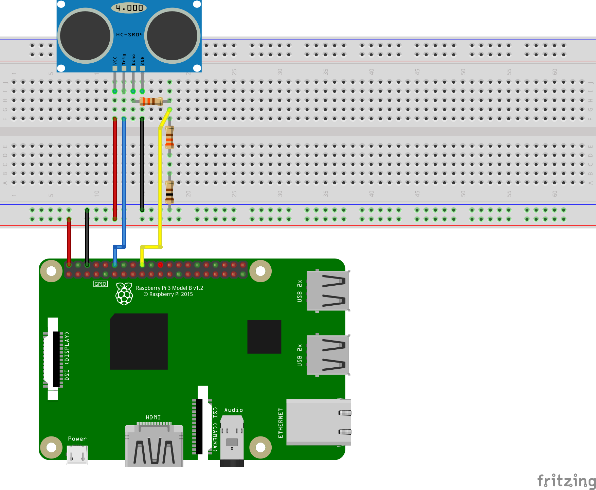

# Java FX 3D application to control Duke with a distance sensor


## Wiring



## Running as Maven project on Raspberry Pi

* Build the application with 

```
mvn clean package
```

* Download and unpack latest JavaFX from [Gluon](https://gluonhq.com/products/javafx/)
and put in "/opt/arm32fb-sdk/"
* If you are using a desktop environment, disable it by either
    * Run `sudo raspi-config` and select "CLI - Boot in command line"
    * Run `/sbin/init 3` to quit X
* Start the application with

```
bash start.sh
```